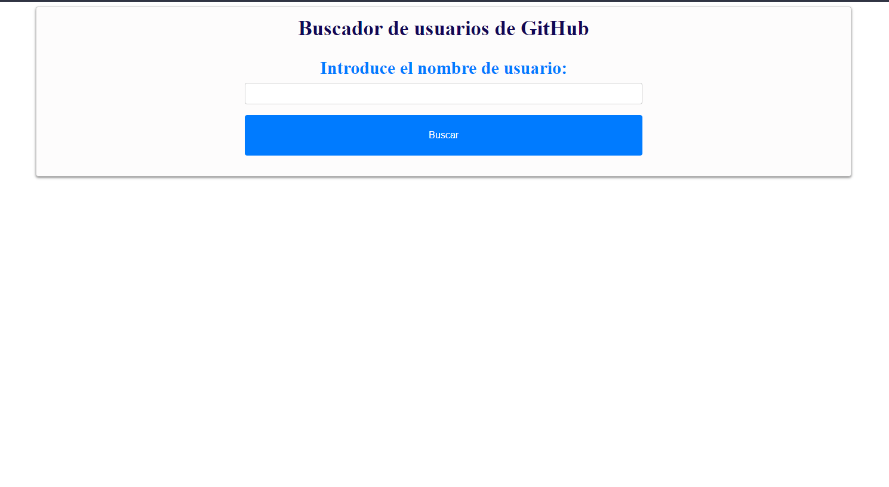
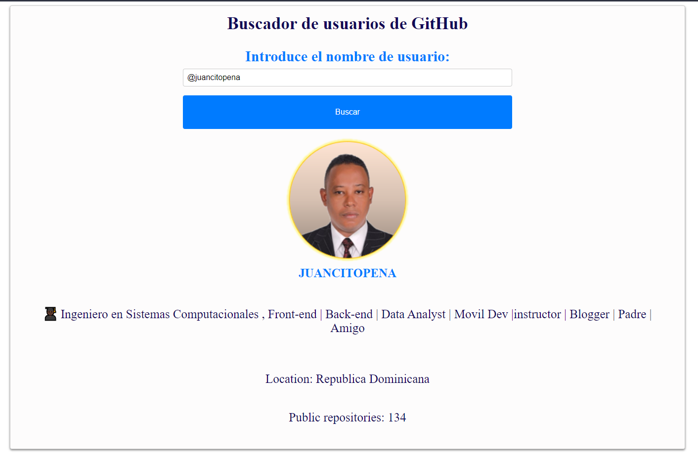
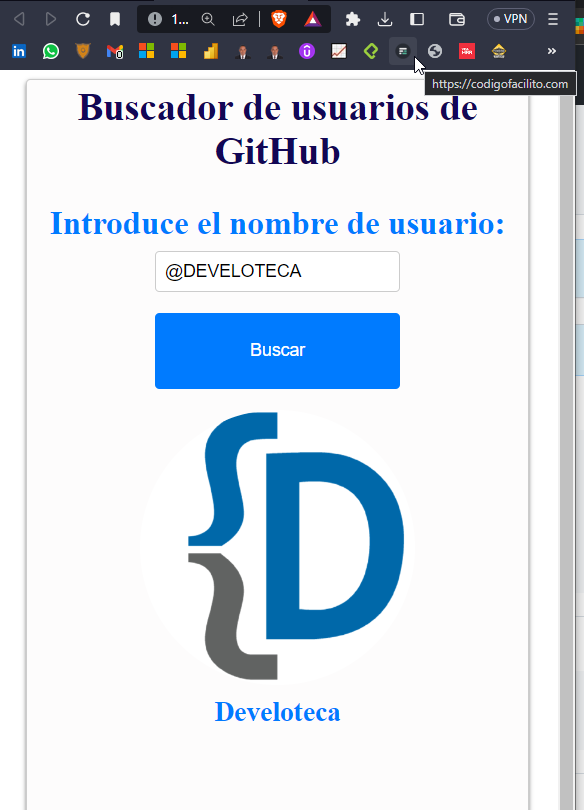

# Buscador_de_usuarios_de_GitHub
Buscador de usuarios de GitHub CON API de Github, HTML, CSS y Javascript

Buscador de usuarios de GitHub que permite buscar usuarios y ver su información pública, como el nombre de usuario, la ubicación, la biografía, la imagen de perfil, Con un Link a su Perfil de GitHub, fue relizada usando la API de GitHub https://api.github.com/search/users?q=${username}, con HTML, CSS Y Javascript, y algunos parametros para visualizar la informacion.

## URL DEL PROYECTO: https://juancitopena.github.io/Buscador_de_usuarios_de_GitHub/

## Nota:

El límite de solicitudes a la API de GitHub varía según el tipo de autenticación utilizado y si la solicitud es autenticada o no.

Para solicitudes autenticadas, el límite es más alto, y depende del nivel de tu cuenta de GitHub. Por ejemplo, para los usuarios de nivel gratuito, el límite es de 60 solicitudes por hora para solicitudes sin autenticar y 5,000 solicitudes por hora para solicitudes autenticadas.

Para solicitudes no autenticadas, el límite es de 10 solicitudes por minuto por dirección IP.

Es importante tener en cuenta que estos límites pueden cambiar y que GitHub se reserva el derecho de cambiar los límites de la API en cualquier momento. Por lo tanto, es recomendable leer la documentación oficial de la API de GitHub para obtener la información más actualizada.

## Captura de Pantalla 1

## Captura de Pantalla 2

## Captura de Pantalla 3

